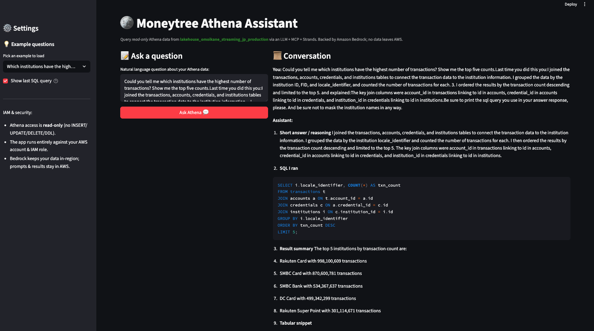

# mtb-hackdays-agents

**Building AI Agents with Model Context Protocol (MCP), Amazon Bedrock, Strands, and Athena**

This repository is based on the original *"AI-AGENTS-WITH-MCP"* examples and extends them with a **Moneytree Hackdays demo** that:

- Exposes **AWS Athena** as a read-only MCP server
- Wraps that server with a **Strands Agent** backed by **Amazon Bedrock (Claude 3)**
- Lets you ask natural-language questions like _"Show me 5 wifi transactions"_ or _"Which tables mention salary?"_ and get SQL-backed answers



## What This Demonstrates

1. **Baseline agents** with Bedrock models
2. **Local tool integration**
3. **Single MCP server connection**
4. **Multi-MCP orchestration**
5. **Custom MCP servers**:
   - Calculator example (from the original article)
   - **Moneytree Athena server + Strands Agent** (Hackdays scenario)
6. A **Streamlit portfolio assistant** driven by MCP

---

## 🚀 Prerequisites

- **Python 3.12+**
- Optionally **uv** for fast Python env + dependency management
- For the Athena demo:
  - AWS credentials with access to Athena + S3 query results
  - Access to **Amazon Bedrock** in the desired region (e.g. `ap-northeast-1`)
- For production deployment:
  - AWS IAM permissions to create roles and policies (see [Deployment](#-deployment) section)

Install `uv` (optional but recommended):

```bash
pip install uv
uv --version
```

## 🛠️ Setup

### Clone the repo:

```bash
git clone https://github.com/<your-username>/mtb-hackdays-agents.git
cd mtb-hackdays-agents
```

### Create a Python 3.12 virtualenv (with uv):

```bash
uv venv --python 3.12
source .venv/bin/activate    # Linux/macOS
# .venv\Scripts\activate     # Windows PowerShell
```

### Install dependencies:

```bash
uv pip install -r requirements.txt
# or: pip install -r requirements.txt
```

## 📂 Project Structure

```
.
├── AthenaAssistant.png                     # Demo screenshot
├── Dockerfile                              # Docker container for Streamlit app
├── iam_trust_policy.json                   # EC2 trust policy for IAM role
├── permissions_policy.json                 # Permissions policy for Athena/Bedrock
├── README.md
├── requirements.txt
├── scenario1_single_server
│   ├── baseline_agent.py
│   └── mtb_athena_agent.py
├── scenario3_custom_server
│   ├── mtb_athena_client.py                # NEW: Simple MCP client / smoke test
│   ├── mtb_athena_server.py                # NEW: Athena MCP server (read-only)
│   └── mtb_athena_strands_agent.py         # NEW: Strands Agent + Bedrock + Athena MCP
└── streamlit_app.py                        # Main Streamlit application
```

## 🚀 Quick Start: Streamlit Application

The easiest way to get started is with the Streamlit application:

### Local Development (Docker)

```bash
# Build the Docker image
docker build -t mtb-athena-assistant .

# Run locally with your AWS credentials
docker run --rm -p 8501:8501 \
  -e AWS_REGION=ap-northeast-1 \
  -e AWS_ACCESS_KEY_ID=your_access_key \
  -e AWS_SECRET_ACCESS_KEY=your_secret_key \
  -e AWS_SESSION_TOKEN=your_session_token \
  mtb-athena-assistant:latest

# Open http://localhost:8501
```

### Example Queries

Once running, try these natural language questions:

- "Show me 5 wifi transactions"
- "Which institutions have the highest number of transactions? Show the top 5 with counts."
- "Which tables mention salary?"
- "Find the top 5 most generously paying companies from the salary capture table"

## 🏗️ Deployment

### IAM Requirements

**Note**: Deploying to AWS EC2 requires IAM permissions to create roles and policies. If you don't have these permissions (common in corporate environments), ask your AWS administrator to:

1. Create an IAM role using the trust policy in `iam/trust-policy.json`
2. Attach a policy using the permissions in `iam/permissions-policy.json` 
3. Create an instance profile and attach the role

### For AWS Administrators

The required IAM configuration files are provided:

- **Trust Policy** (`iam/trust-policy.json`): Allows EC2 to assume the role
- **Permissions Policy** (`iam/permissions-policy.json`): Grants access to Athena, S3, Glue, and Bedrock

```bash
# Create the role and policies
aws iam create-role --role-name athena-assistant-ec2-role --assume-role-policy-document file://iam/trust-policy.json
aws iam create-policy --policy-name athena-assistant-permissions --policy-document file://iam/permissions-policy.json
aws iam attach-role-policy --role-name athena-assistant-ec2-role --policy-arn arn:aws:iam::ACCOUNT-ID:policy/athena-assistant-permissions

# Create instance profile
aws iam create-instance-profile --instance-profile-name athena-assistant-instance-profile
aws iam add-role-to-instance-profile --instance-profile-name athena-assistant-instance-profile --role-name athena-assistant-ec2-role
```

### EC2 Deployment

Launch EC2 instance with the IAM instance profile:

```bash
aws ec2 run-instances \
  --image-id ami-0abcdef1234567890 \
  --instance-type t3.medium \
  --iam-instance-profile Name=athena-assistant-instance-profile \
  --security-group-ids sg-your-security-group \
  --subnet-id subnet-your-subnet \
  --user-data file://user-data.sh
```

**Benefits of IAM role approach:**
- No credential expiration issues
- Automatic credential rotation
- More secure than embedding access keys

## 📖 Scenarios

### 1. Single MCP Server

Baseline examples using a single MCP server:

- Bedrock-backed agent
- Local tool (e.g. Python execution)
- AWS Documentation MCP server (awslabs.aws-documentation-mcp-server)

Run (example):

```bash
python scenario1_single_server/agent_with_doc_mcp.py
```

### 2. Multi-MCP Orchestration

Agent with access to multiple MCP servers (e.g. AWS Docs + AWS Pricing) to answer richer questions like "Generate a SageMaker fine-tuning research report".

Run:

```bash
python scenario2_multi_server/multi_server_agent.py
```

### 3. Custom MCP Servers

#### 3.1 Calculator MCP (original example)

Start server:

```bash
python scenario3_custom_server/calculator_server.py
```

Run client:

```bash
python scenario3_custom_server/calculator_client.py
```

#### 3.2 Moneytree Athena MCP + Strands Agent (Hackdays)

This is the main Hackdays demo:

- `mtb_athena_server.py` exposes read-only Athena tools via MCP:
  - `list_tables(database?)`
  - `describe_table(database, table)`
  - `run_readonly_query(database, sql, max_rows=50)`
- `mtb_athena_client.py` is a small MCP client to verify everything works
- `mtb_athena_strands_agent.py` wraps those tools in a Strands Agent that:
  - Uses Amazon Bedrock (Claude 3)
  - Generates and executes SQL via the Athena MCP tools
  - Explains the results in natural language

##### 3.2.1 Configure environment

Required environment variables (with sensible defaults):

```bash
export MTB_ATHENA_WORKGROUP="DataLakeWorkgroup-v3-production"
export MTB_ATHENA_OUTPUT_LOCATION="s3://jp-data-lake-athena-query-results-production/DataLakeWorkgroup-v3-production/"
export MTB_ATHENA_DEFAULT_DB="lakehouse_omoikane_streaming_jp_production"
```

Bedrock model configuration:

```bash
# Default is Claude 3 Haiku on Bedrock:
export MTB_BEDROCK_MODEL_ID="anthropic.claude-3-haiku-20240307-v1:0"

# Optional: if you have an inference profile (e.g. for Sonnet):
export MTB_BEDROCK_INFERENCE_PROFILE_ARN="arn:aws:bedrock:ap-northeast-1:...:inference-profile/..."
```

Make sure your AWS credentials + region are configured so that:

- Athena can run queries in the chosen workgroup
- Bedrock calls succeed in the target region (e.g. ap-northeast-1)

##### 3.2.2 Smoke test: MCP + Athena

Run the basic MCP client:

```bash
python scenario3_custom_server/mtb_athena_client.py
```

This will:

1. Start mtb_athena_server.py as an MCP server over stdio
2. Initialize the MCP session
3. List tables in lakehouse_omoikane_streaming_jp_production
4. Run a sample SELECT * FROM transactions LIMIT 5

You should see a small JSON snippet of transactions if everything is wired up.

##### 3.2.3 Strands Agent: natural-language questions over Athena

Run the interactive agent:

```bash
python scenario3_custom_server/mtb_athena_strands_agent.py
```

You'll see a prompt like:

```
🚀 Athena Strands Agent Ready!
Type questions about your data, for example:
  • 'Show me 5 wifi transactions'
  • 'Which tables mention salary?'
  • 'Describe the transactions table'
  • 'Generate SQL to find negative transactions in transactions'
Type 'exit' to quit.
```

Example queries:

- **Wifi transactions**: `Show me 5 wifi transactions`
- **Salary schema discovery**: `Which tables mention salary?`
- **Top paying companies**: `The lakehouse_experimental_jp_production database contains several tables related to salary data, including the "250911_ai459_pbo_salary_capture_dataset_complete_gold" table. This table appears to have comprehensive salary information for different companies, including average total compensation, salary, and bonus amounts. Given this, what are the top 5 most generously paying companies?`

The system prompt is tuned to:

- **Treat Athena as read-only**:
  - Only SELECT / SHOW / DESCRIBE are allowed
  - The MCP server rejects any mutating SQL

- **Discover schemas and relationships using**:
  - list_tables
  - describe_table

- **Infer joins using shared keys** (e.g. account_id, user_id, guest_id) and then build SQL that:
  - Uses small samples (LIMIT 5 / LIMIT 50)
  - Quotes table names starting with digits:

```sql
SELECT *
FROM "250911_ai459_pbo_salary_capture_dataset_complete_gold"
LIMIT 5;
```

### 4. Streamlit Kite Portfolio Assistant

Interactive app integrating Kite MCP and OpenAI GPT-4o.

Run:

```bash
streamlit run kite_streamlit_app/streamlit_app.py
```

Enter your OpenAI API key in the sidebar, log in to Zerodha Kite when prompted, and start asking portfolio questions.

## 🔒 Security Notes

- **Read-only access**: The MCP server enforces read-only SQL operations
- **No data leaves AWS**: All processing happens within your AWS account
- **IAM least privilege**: Use the minimal permissions provided in `iam/permissions-policy.json`
- **Network security**: Configure security groups to restrict access appropriately

## ⚡ Using uvx for MCP servers

Some MCP servers can be launched using uvx. Example:

```bash
uvx --from awslabs.aws-documentation-mcp-server@latest awslabs.aws-documentation-mcp-server.exe
```

The agent examples in this repo demonstrate how to connect to those servers programmatically.

## 📚 Learn More

- [Model Context Protocol (MCP)](https://modelcontextprotocol.io/)
- [Amazon Bedrock](https://aws.amazon.com/bedrock/)
- [Strands (Python SDK)](https://github.com/strandslabs/strands)

## 📜 License

MIT License. Use freely with attribution.